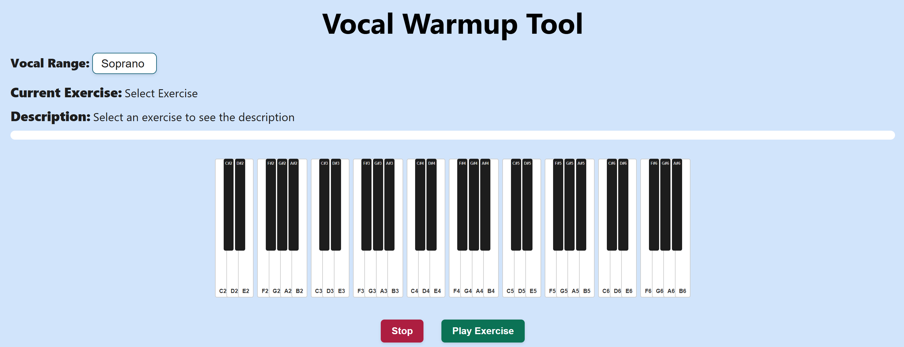
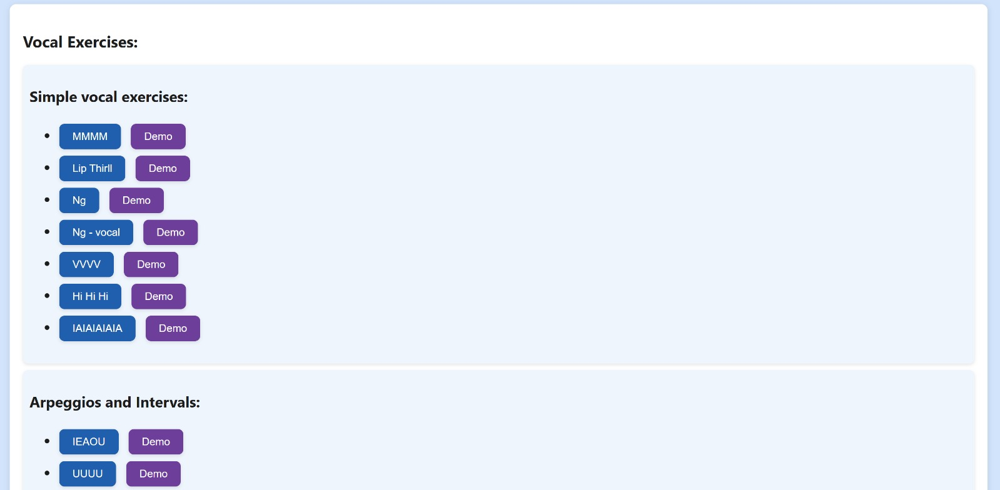
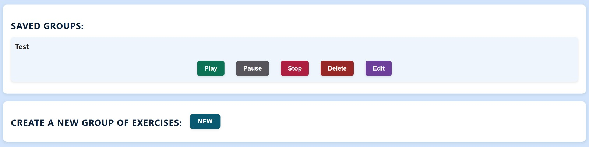

# Vocal-Warmup-Tool


A web application designed to help singers warm up their voices with customizable vocal exercises. It features interactive piano feedback and arpeggio-based exercises tailored to different vocal ranges.

## Table of Contents

1. [Overview](#overview)
2. [Features](#features)
3. [How to Install](#how-to-install)
4. [How to Use](#how-to-use)
5. [Technologies Used](#technologies-used)
6. [Code Architecture](#code-architecture)
7. [Visual Preview](#visual-preview)
8. [License & Usage Terms](#license--usage-terms)


## Overview
Vocal-Warmup-Tool is a web-based application that enables users to fully customize their vocal warmup routine. It offers a wide selection of vocal exercises, organized into categories based on their function (e.g., articulation, range, belt, legit), and allows users to adapt each exercise to their personal vocal range. Users can also create and save custom groups of exercises to always have their ideal warmup sequence ready.

In addition, the app includes Pitch Training tools that help users improve their accuracy in singing specific intervals or musical scales. These exercises include real-time pitch detection and feedback.

Designed for singers of all levels — from beginners to professionals — the tool is lightweight and runs entirely in the browser, requiring no installation. It provides an all-in-one space for daily vocal practice and skill development, combining vocal technique and ear training.


## Features

1. Wide Range of Vocal Exercises: Choose from a variety of exercises categorized by type (articulation, belt, legit, vocal range extension, and more).
2. Personalized Vocal Range Adaptation: Adjust exercises to your specific vocal range (bass, baritone, tenor, alto, mezzo, soprano).
3. Create and Save Custom Exercise Groups: Build your own warmup routines by selecting exercises, naming the group, and saving it for quick access.
4. Predefined Warmup Groups: Quick Warmup, Long Warmup, Legit Warmup, and Belt Warmup ready to use based on your needs.
5. Pitch Training Exercises: Train your ear and voice with real-time pitch detection through arpeggios, scales, and random intervals.
6. Interactive On-Screen Keyboard: Visual feedback of the notes being played during exercises to support learning.
7. Progress Tracking: Visual progress bar during exercises to easily see how much is left.
8. Audio Demos Available: Listen to a demo of each exercise before starting, to better understand how to perform it.

## How to Install 
### 1. Clone this repository: 
```bash
git clone https://github.com/vennanna/Vocal-Warmup-Tool.git
```
### 2. Open the project folder:
```bash
cd vocal-warmup-tool
```
### 3. Open the application:

Simply open index.html in your browser. Or, if you are using Visual Studio Code:

- Install the Live Server extension (if not already installed).

- Right-click on index.html and select "Open with Live Server".


## How to Use


### 1. Single Exercises:

You can perform a single exercise by selecting it from the corresponding category. Exercises in different categories focus on different vocal skills. After selecting an exercise, a short description will appear explaining how to perform it correctly.
Choose your correct vocal range and start the exercise (which will cover approximately one octave of the selected range).

If you want to hear a demo of how the exercise is performed, simply press the "Demo" button next to it.
To assist you during execution, the corresponding keys on the virtual keyboard will light up while playing the notes, and a progress bar will indicate how much of the exercise is left.

Note: The keyboard lighting and progress bar are available for standard vocal exercises, not for pitch exercises.

### 2. Default Groups:

There are four predefined warmup groups available (Quick Warmup, Long Warmup, Legit Warmup, Belt Warmup).
Simply choose the one that best fits your needs: the exercises included in the group will start automatically one after the other, adapted to your selected vocal range.
You can stop or pause the execution of a group at any time.

### 3. Create a Custom Group:
   
You can create your own personalized exercise group by clicking the "New" button.
A list of all available exercises divided by category will appear.
You can select as many exercises as you like, assign a name to the group, and save it.
The exercises will be performed in the order they are listed (but you can later modify the group if needed).

### 4. Saved Groups:
   
Here you will find the groups you previously saved.
You can start a saved group, pause it, stop it, delete it, or modify its contents.

### 5. Pitch Exercises:
   
Finally, you can train your pitch accuracy through dedicated exercises:

- Arpeggios: This trains you in singing arpeggios. You can select the mode (major or minor) and the starting note. The exercise does not move to the next note until you sing the correct one and hold it steadily for at least half a second.

- Scales: Similar to arpeggios, but with musical scales (major, minor, chromatic).

- Random Intervals: More challenging — the next notes are not predictable, as they are separated by random intervals. Memory alone is not enough; you must rely on pitch accuracy.

The Stop button stops the execution of any ongoing pitch exercise immediately.


## Technologies Used


### Core Technologies:
1. JavaScript: is the main programming language used to implement the app’s logic and interactivity. It handles everything from sound generation and pitch detection to UI updates and exercise flow control.
2. HTML: is used to define the structure and semantic elements of the web application, including the layout of exercises, buttons, and modals.
3. CSS: provides the visual styling of the interface, including colors, layouts, responsiveness, and feedback animations.

### Code Architecture:

The project is organized using the MVC (Model–View–Controller) design pattern:

1. Model: Manages the data and core logic of the application, such as the definition of exercises, user vocal range, and playback sequence generation.
2. View: Handles the visual interface and updates the DOM in response to user actions and program state.
3. Controller: Coordinates input, updates the model, and triggers the appropriate view updates or playback actions.

Using MVC improves code separation, modularity, and maintainability, making it easier to expand or debug each part of the system independently.

### External Libraries
1. Tone.js: A powerful Web Audio framework for creating and scheduling audio. Tone.js is used to generate all the sounds in the application, including keyboard tones and dynamic playback of all exercises and scales.
2. Yin Pitch Detector: A JavaScript implementation of the YIN algorithm, based on autocorrelation. This algorithm is used to estimate the fundamental frequency of sung notes during pitch training exercises.


## Code Architecture 


### Classic Exercises Playback:
This section describes the logic behind the execution of classic vocal exercises, i.e. those that do not use pitch detection.

1. Main Playback Flow: When a user selects a vocal range and an exercise, the function playArpeggioWithRange(selectedExercise) is called.
```javascript
function playArpeggioWithRange(selectedExerciseParam = DEFAULT_EXERCISE, totalExercises = 1, onCycleComplete = null, completedArpeggiosCumulative = 0) {
    if (isPlaying) stopArpeggio();  


  isPlaying = true;
  isPaused  = false;

  const selectedRange = vocalRanges[vocalRangeSelector.value];
  minNote = selectedRange.min;
  maxNote = selectedRange.max;
  selectedExercise = selectedExerciseParam;

  notesData = generateInitialArpeggio(minNote, DEFAULT_REFERENCE_NOTE, selectedExercise);

  synth = new Tone.Synth().toDestination();
  currentNoteIndex = 0;
  currentDirection = "ascendente";
  completedRangeCycles = 0;
  totalRangeCyclesRequired = 1;
  completedArpeggios = 0;
  totalArpeggiosRequired = totalExercises * 15;

  progressBar = document.getElementById("progress-bar");
  if (!progressBar) {
    return;
  }

  progressBar.style.width = "0%";

  playNextNote();
}
```

This function:

- Stops any currently running exercise.
- Sets the selected vocal range and exercise.
- Generates the notes of the exercise, transposed to fit within the selected vocal range, using the function generateInitialArpeggio(...).
```javascript
function generateInitialArpeggio(minNote, referenceNote = DEFAULT_REFERENCE_NOTE, exerciseType = DEFAULT_EXERCISE) {
  const { notes, durations } = exercises[exerciseType];
  if (!notes || !durations) {
    return [];
  }

  const referenceFreq = Tone.Frequency(referenceNote).toFrequency();
  const minFreq = Tone.Frequency(minNote).toFrequency();
  const semitoneOffset = Math.round(12 * Math.log2(minFreq / referenceFreq));

  return notes.map((note, index) => {
    let noteWithOctave = `${note}${referenceNote.slice(-1)}`;  
    const duration = durations[index]; 

    return {
      note: Tone.Frequency(noteWithOctave).transpose(semitoneOffset).toNote(),
      duration: duration
    };
  });
}
```
- If the exercise is part of a group (see below), it calculates the total number of required arpeggios. Each exercise must be repeated 15 times to complete: notes go up by 1 semitone each cycle, and down by 3 semitones.
- Starts the playback loop by calling playNextNote().

2. playNextNote():

```javascript
function playNextNote() {

  if (isPaused) {
    return;
  }

  if (!notesData || notesData.length === 0) {
    return;
  }

  const noteData = notesData[currentNoteIndex];

  removeAllKeyFeedback();
  addKeyFeedback(noteData.note);

  synth.triggerAttackRelease(noteData.note, noteData.duration);

  currentNoteIndex = (currentNoteIndex + 1) % notesData.length;

  if (currentNoteIndex === 0) {
    completedArpeggios++;
    const progress = ((completedArpeggios) / totalArpeggiosRequired) * 100;
    progressBar.style.width = `${progress}%`;

    if (currentDirection === "ascendente") {
      notesData = notesData.map((note) => ({
        note: Tone.Frequency(note.note).transpose(1).toNote(),
        duration: note.duration
      }));

      if (Tone.Frequency(notesData[notesData.length - 1].note).toFrequency() >= Tone.Frequency(maxNote).toFrequency()) {
        currentDirection = "discendente";
      }
    } else {

      const descendingStep = 3; // Scende di 3 semitoni invece di 1
      notesData = notesData.map((note) => ({
        note: Tone.Frequency(note.note).transpose(-descendingStep).toNote(),
        duration: note.duration
      }));

      if (Tone.Frequency(notesData[0].note).toFrequency() <= Tone.Frequency(minNote).toFrequency()) {
        currentDirection = "ascendente";
        completedRangeCycles++;

        if (completedRangeCycles >= totalRangeCyclesRequired) {
          return;
        }
      }
    }
  }

  if (!isPaused) {
    currentTimeoutId = setTimeout(playNextNote, Tone.Time(noteData.duration).toMilliseconds());
  }
}


```


This function:

- Highlights the currently played note on the keyboard interface.
- Plays the note using the Tone.Synth.
- Updates the progress bar accordingly.
- Manages the upward/downward transposition of the arpeggio.
- Recursively calls itself after each note duration.

Ascending notes are transposed by +1 semitone until reaching the top of the range. Then, the direction switches to descending, where each repetition lowers the notes by 3 semitones, until the minimum note is reached again. After a full up-down cycle, the completedRangeCycles counter increases.

3. Exercise Groups: When a group of exercises is selected, the function playExerciseGroup(exerciseGroup) is triggered:
```javascript
function playExerciseGroup(exerciseGroup) {
  let currentExerciseIndex = 0; // Indice dell'esercizio corrente
  let completedArpeggiosCumulative = 0; // Arpeggi completati in totale
  isPlaying = true;
  isPaused = false;

  function playCurrentExercise() {
    if (currentExerciseIndex >= exerciseGroup.length) {
      Tone.Transport.stop();
      return;
    }

    const currentExercise = exerciseGroup[currentExerciseIndex];
    updateCurrentExerciseLabel(currentExercise);
    const totalRangeCyclesNeeded = 1;

    playArpeggioWithRange(
      currentExercise,
      exerciseGroup.length, 
      (completedRangeCycles, updatedCompletedArpeggios) => {
        completedArpeggiosCumulative = updatedCompletedArpeggios; 
        if (completedRangeCycles >= totalRangeCyclesNeeded) {
          currentExerciseIndex++;
          playCurrentExercise(); 
        }
      },
      completedArpeggiosCumulative 
    );
  }

  playCurrentExercise();
}
```


This function:

- Initializes a counter currentExerciseIndex and a cumulative counter for completed arpeggios.
- Defines an inner function playCurrentExercise() that:
- Calls playArpeggioWithRange() for the current exercise.
- Waits for it to complete a full up-down cycle.
- Moves on to the next exercise until the entire group is completed.

This structure allows sequential execution of multiple exercises while maintaining a global progress.

### Group Management:
Users can create custom exercise groups by selecting multiple vocal exercises and saving them with a custom name. These groups are saved in the browser’s localStorage, allowing them to persist across sessions.

To achieve this, the app uses two key functions:
```javascript
function saveGroupToLocalStorage(group) {
  const savedGroups = getSavedGroups();
  savedGroups.push(group);
  localStorage.setItem("savedGroups", JSON.stringify(savedGroups));
}

function getSavedGroups() {
  try {
    return JSON.parse(localStorage.getItem("savedGroups")) || [];
  } catch (error) {
    return [];
  }
}
```
JSON (JavaScript Object Notation) is a lightweight data format used to store and exchange data between a server and a client. In this application:

- JSON.stringify() converts JavaScript objects (like the list of groups) into a JSON string for storage.

- JSON.parse() transforms these strings back into usable JavaScript objects when loading the data.

This approach allows the app to persist user-created groups in a structured and efficient way, even after the page is reloaded or the browser is closed.

Users can also edit or delete saved exercise groups.
Editing opens a modal where the exercises in the group can be modified, while deletion permanently removes the group from localStorage and updates the interface in real time.

### Pitch Detection Exercises:
Pitch detection exercises (arpeggios, scales, and random intervals) guide the user through singing specific notes while the system checks pitch accuracy in real time using the YIN algorithm. The exercise flow is as follows:

1. Exercise selection and note input: the user starts by selecting an exercise type:
- Arpeggios → openModal('Arpeggi')
- Scales → openModal('Scale')
- Random intervals → confirmAccordiRandom()

They then choose the scale type (major/minor/chromatic) and a starting note. Based on the selection, one of the following functions is called:
- startArpeggio(type, rootNote)
```javascript
function startArpeggio(type, rootNote) {
  exerciseType = 'arpeggio';
  currentStep = 0;

  const semitoneOffsets = (type === 'major') ? [0, 4, 7] : [0, 3, 7];

  const notes = ["C", "C#", "D", "D#", "E", "F", "F#", "G", "G#", "A", "A#", "B"];
  const rootMatch = rootNote.match(/^([A-G]#?)(\d)$/);
  const rootIndex = notes.indexOf(rootMatch[1]);
  const rootOctave = parseInt(rootMatch[2]);

  const ascending = semitoneOffsets.map(offset => {
    let noteIndex = rootIndex + offset;
    let octave = rootOctave;
    while (noteIndex >= 12) {
      noteIndex -= 12;
      octave += 1;
    }
    return `${notes[noteIndex]}${octave}`;
  });

  const descending = [...ascending].reverse().slice(1);
  targetNotes = [...ascending, ...descending];

  // Creiamo gli eventi
  const events = targetNotes.map((note, index) => [index * 0.4, note]);

  if (exercisePart) {
    exercisePart.dispose();
  }

  exercisePart = new Tone.Part((time, note) => {
    playNote(note, time);
  }, events);

  exercisePart.start(0);
  Tone.Transport.start();

  document.getElementById('instruction-display').textContent = `Listen to the arpeggio...`;

  const totalDuration = targetNotes.length * 0.4;
  setTimeout(() => {
    document.getElementById('instruction-display').textContent = `Now sing the arpeggio!`;
    isListening = true;
  }, totalDuration * 1000);
}
```

- startScala(type, rootNote)
```javascript
function startScala(type, rootNote) {
  exerciseType = 'scale';
  currentStep = 0;

  const scalePatterns = {
    "major": [0, 2, 4, 5, 7, 9, 11, 12],
    "minor": [0, 2, 3, 5, 7, 8, 10, 12],
    "cromatic": Array.from({ length: 13 }, (_, i) => i)
  };

  const notes = ["C", "C#", "D", "D#", "E", "F", "F#", "G", "G#", "A", "A#", "B"];
  const rootMatch = rootNote.match(/^([A-G]#?)(\d)$/);
  const rootIndex = notes.indexOf(rootMatch[1]);
  const rootOctave = parseInt(rootMatch[2]);

  const ascending = scalePatterns[type].map(offset => {
    let noteIndex = rootIndex + offset;
    let octave = rootOctave;
    while (noteIndex >= 12) {
      noteIndex -= 12;
      octave += 1;
    }
    return `${notes[noteIndex]}${octave}`;
  });

  const descending = [...ascending].reverse().slice(1);
  targetNotes = [...ascending, ...descending];


  const events = targetNotes.map((note, index) => [index * 0.4, note]);

  if (exercisePart) {
    exercisePart.dispose();
  }

  exercisePart = new Tone.Part((time, note) => {
    playNote(note, time);
  }, events);

  exercisePart.start(0);
  Tone.Transport.start();

  document.getElementById('instruction-display').textContent = `Listen to the scale...`;

  const totalDuration = targetNotes.length * 0.4;
  setTimeout(() => {
    document.getElementById('instruction-display').textContent = 'Now sing the scale!';
    isListening = true;
  }, totalDuration * 1000);
}
```
- startAccordiRandom(startingNote)
  
```javascript
function startAccordiRandom(startingNote) {
  exerciseType = 'intervalli-random';
  currentStep = 0;
  targetNotes = [startingNote];
  chosenIntervals = [];
  const intervalsAvailable = [
    { name: "Major second up", semitones: 2 },
    { name: "Minor second down", semitones: -1 },
    { name: "Major third up", semitones: 4 },
    { name: "Minor third down", semitones: -3 },
    { name: "Perfect fourth up", semitones: 5 },
    { name: "Perfect fifth down", semitones: -7 }
  ];


  for (let i = 0; i < 5; i++) {
    const random = intervalsAvailable[Math.floor(Math.random() * intervalsAvailable.length)];
    chosenIntervals.push(random);
  }

  let currentFrequency = noteToFrequency(startingNote);

  chosenIntervals.forEach(interval => {
    currentFrequency *= Math.pow(2, interval.semitones / 12);
    const nextNote = frequencyToNote(currentFrequency);
    targetNotes.push(nextNote);
  });

  Tone.start();

  const events = targetNotes.map((note, index) => [index * 0.8, note]); // 0.8s invece di 0.4s per dare tempo di ascoltare

  if (exercisePart) {
    exercisePart.dispose();
  }

  exercisePart = new Tone.Part((time, note) => {
    playNote(note, time);
  }, events);

  exercisePart.start(0);
  Tone.Transport.start();

  document.getElementById('instruction-display').textContent = `Listen to the sequence...`;

  const totalDuration = targetNotes.length * 0.8;
  setTimeout(() => {
    document.getElementById('instruction-display').textContent = `Now sing the sequence`;
    isListening = true;
    startMicrophone();

  }, totalDuration * 1000);
}
```
Each function generates a list of targetNotes based on the exercise type:
- Arpeggios: ascending and descending triads
- Scales: full scales (up and down)
- Random intervals: dynamically created note sequences using randomly chosen musical intervals

These notes are then played back using Tone.Part, allowing the user to hear the full sequence before singing.

3. Microphone activation and pitch tracking: once the example has been played, the app activates the microphone by calling startMicrophone().
```javascript
async function startMicrophone() {
  if (!audioContext || audioContext.state === 'closed') {
    audioContext = new AudioContext();
  }
  const stream = await navigator.mediaDevices.getUserMedia({ audio: true });
  source = audioContext.createMediaStreamSource(stream);
  processor = audioContext.createScriptProcessor(2048, 1, 1);
  source.connect(processor);
  processor.connect(audioContext.destination);

  let holdStart = null;
  let isHolding = false;

  processor.onaudioprocess = (event) => {
    if (!isListening) return;
    const input = event.inputBuffer.getChannelData(0);
    const pitch = yin.detect(input, audioContext.sampleRate);

    if (pitch && targetNotes.length > 0 && targetNotes[currentStep]) {
      const detected = frequencyToNote(pitch);
      document.getElementById('note-display').textContent = `Note detected: ${detected}`;

      const expectedFrequency = noteToFrequency(targetNotes[currentStep]);
      if (!expectedFrequency) return;

      const cents = getCentsDifference(pitch, expectedFrequency);


      if (Math.abs(cents) < 40) {
        if (!holdStart) {
          holdStart = Date.now();
          isHolding = true;
          document.getElementById('instruction-display').textContent = "Hold the pitch...";
        } else if (Date.now() - holdStart > 500) {
          if (exerciseType === 'arpeggio' || exerciseType === 'scale') {
            currentStep++;
            holdStart = null;
            isHolding = false;
            if (currentStep >= targetNotes.length) {
              document.getElementById('instruction-display').textContent = "Exercise completed!";
              isListening = false;
            } else {
              document.getElementById('instruction-display').textContent = "Good job! Next note:";
              setTimeout(() => {
                document.getElementById('instruction-display').textContent = `Sing: ${targetNotes[currentStep]}`;
                playNote(targetNotes[currentStep - 1]);
              }, 1000);
            }
          }

          if (exerciseType === 'intervalli-random') {
            playNote(targetNotes[currentStep]); // Suona la nota appena cantata giusta
            currentStep++;
            holdStart = null;
            isHolding = false;
            if (currentStep >= targetNotes.length) {
              document.getElementById('instruction-display').textContent = "Exercise completed!";
              isListening = false;
            } else {
              const intervalName = chosenIntervals[currentStep - 1].name;
              const nextNote = targetNotes[currentStep];
              document.getElementById('instruction-display').textContent = `Sing a ${intervalName} (${nextNote})`;
            }
          }
        }
      }
    }
  }
}

```

This function:
- Creates an AudioContext
- Connects the microphone input to a ScriptProcessorNode
- Uses the YIN pitch detection algorithm to track incoming audio and extract the sung frequency in real time

During each audio frame (onaudioprocess), it
- Converts the detected frequency into a note
- Compares it with the expected targetNote
If the sung note is within ±40 cents of the target and held steady for 500ms, it plays the correct note again and proceeds to the next one

This process continues until all target notes have been successfully sung.


## Visual Preview 


### Home: 


### Exercises: 


### Groups: 


### Pitch Exercises: 


## License & Usage Terms

Warmup-Vocal-Tool © 2025 All Rights Reserved.  
No part of this project may be reproduced or used without permission.
